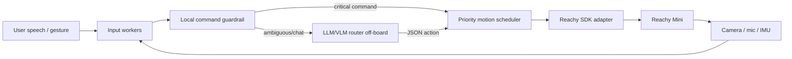

# SDD 02: Design

## Component diagram



## Runtime contract

All actions should be represented as JSON-like objects:

```json
{
  "name": "dance",
  "tool": "dance",
  "priority": "background",
  "interruptible": true,
  "duration_ms": 30000,
  "chunk_ms": 500,
  "deadline_ms": 2000,
  "metadata": {"dance_name": "happy"}
}
```

## Scheduling policy

1. Critical actions preempt background actions only when the running action is interruptible; if the running action has `interruptible=False`, the new critical is queued and a `preempt_blocked` event is emitted.
2. Interactive actions may preempt background actions at chunk boundary, but only when the running action is interruptible; otherwise a `boundary_preempt_blocked` event is emitted and the interactive stays queued.
3. Background actions queue FIFO.
4. The scheduler must never call LLM/VLM synchronously.
5. The scheduler must remain deterministic and unit-testable.
6. The `preempt` event `details` includes `from_priority` and `to_priority` (lower-case priority name strings) for audit trail completeness.
7. All priority strings in `SchedulerEvent.details` are lower-case. This applies to every event type that carries a priority field, including `queued` (`details["priority"]`), `preempt` (`details["from_priority"]`, `details["to_priority"]`), and any future events. The implementation uses `priority.name.lower()` uniformly. (Confirmed 2026-05-28: Phase 3 fix corrected `queued` event which was emitting `"BACKGROUND"` instead of `"background"`.)

## Intent routing policy

Local guardrail owns:

- stop;
- pause;
- hush/quiet;
- emergency;
- obvious dance/emotion commands;
- obvious non-command statements.

LLM owns:

- semantic emotion mapping;
- context-sensitive hospital assistant behavior;
- ambiguous utterances requiring conversation history.

## External profile/tool integration

The folder `external_content/` is shaped for the official conversation app:

```text
external_content/
├── external_profiles/hospital_assistant/
│   ├── instructions.txt
│   └── tools.txt
└── external_tools/
    └── interruptible_action.py
```

The first implementation can call this repo as a library from external tool code. Later, the scheduler can be embedded directly into the official app or packaged as a plugin.
